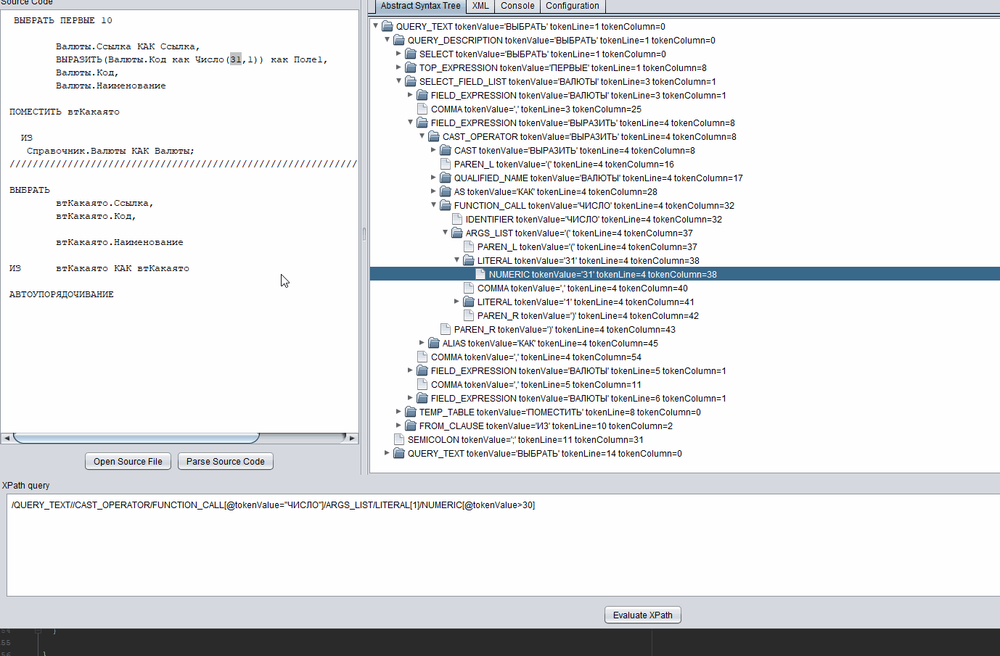

## Язык 1С представляет собой AST дерево

а это значит что к нему применимы любые XPath поиски

Пример AST дерева можно увидеть тут [AST дерево](./query-ast-example.xml)

## Язык запросов 1С тоже транслируется в дерево

включая динамические запросы формируемые последовательно программистом

поэтому к языку запросов также можно приложить XPath выражения поиска

