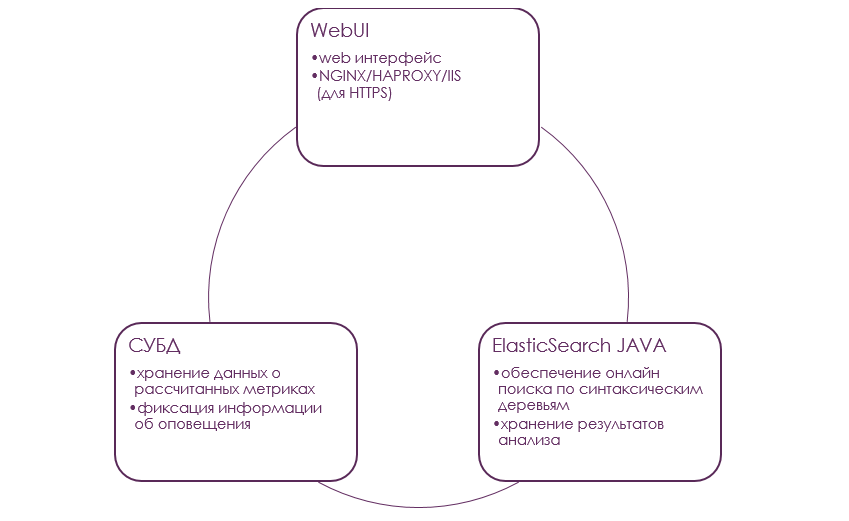

Архитектура сервера SonarServer
-------------------------------

Архитектура SonarQube сервера для установки представляет собой следующую схему

То есть – если написать простым языком:

-   **Существует приложение, запускаемое в консоли, которое сканирует исходный
    код под названием sonar-runner.**

    -   Приложение написано на **Java** и инсталлируется через систему
        **Maven;**

    -   Обычно запускается в контексте агента сборки на сервере непрерывной
        интеграции.

-   **Сервер непрерывной интеграции, а точнее его агент:**

    -   Умеет скачивать исходные коды с GIT сервера;

    -   Умеет опрашивать GIT об изменениях, чтобы запускать сканер исходных
        кодов **sonar-runner.**

-   **Существует служба-сервер SonarQube, которая получает данные от сканера
    sonar-runner по HTTP(S).**

    -   Служба написана на Java и состоит из 3 компонентов

        -   Компонент анализа - использующий встроенный полнотекстовый поиск на
            базе **ElasticSearch;**

        -   Компонент доступа к СУБД на базе JDBC - для чтения результатов
            анализа и сохранения данных о замечаниях;

            -   Учитывая наличие JDBC – СУБД может быть любой, но я обычно
                использую PostgreSQL, потому что, насколько мне известно,
                автоматизированное тестирование платформы SonarQube идет именно
                на нём.

        -   Компонент пользовательского интерфейса на базе Ruby On Rails,
            запускаемый посредством интерпретатора jRuby.

И вся эта конструкция обеспечивает проверку любого изменения исходного кода и
проверку его согласно правил и пределов по качеству.
