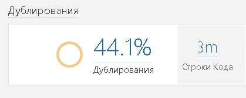
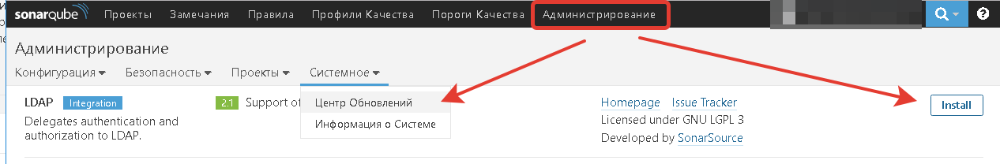

Группы доступа
--------------

Нужно гарантировано разделять группы доступа, так как информация о качестве, она
может как привлекательной, и тогда её, конечно, надо публиковать, а может быть и
не совсем правильной; тогда крайне желательно её показывать только ответственным
за исправление, но никак не клиентам. Например, процент дублирования, где из 3
миллионов строк код 44% «копипаст» лучше никому не показывать.

Поэтому рекомендуемые группы доступа:

| **Группа**               | **Описание**                                                                                                              |
|--------------------------|---------------------------------------------------------------------------------------------------------------------------|
| **Admins**               | Могут всё, должно быть не больше 3-ех человек.                                                                            |
| **developers**           | Команда разработки – разработчики, которые подчиняются Вам, видят почти все проекты как минимум в режиме «только чтение». |
| **outsourcers-\<name\>** | Команда аутсорсеров, по имени компании – имеют доступ только к своему проекту.                                            |
| **Anonymous**            | Тот, кого вы не знаете – в общем случае не имеет доступ вообще никуда.                                                    |

По умолчанию – новые проекты создаем в зоне администратора, только затем
переводим в группу «тех, кому хотим открыть».

Настройка проектов
------------------

Подключите плагины, делается это нажатием кнопки **Install**

Обратите внимание, что первый плагин, который лучше всего устанавливать – это
включение русского языка
