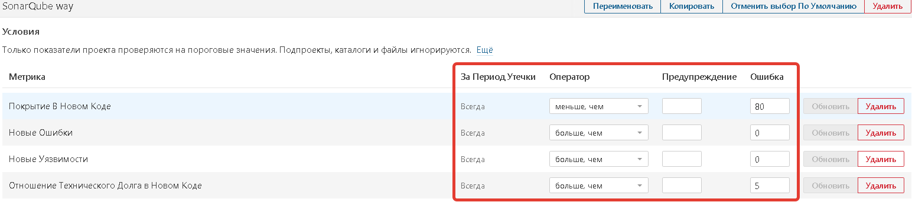
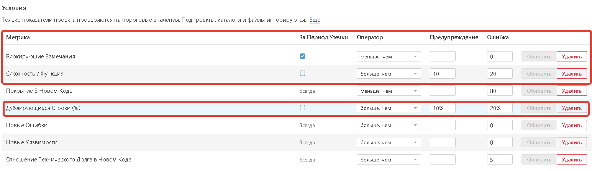

Анализатор кода
---------------

По умолчанию SonarQube считает, что порог качества любого проекта пройдет, если:

-   Покрытие кода тестами в новом коде (в очередном коммите) не менее, чем 80%;

-   В новом коде не возникло новых замечаний с типом «Ошибка»;

-   В новом не возникло новых уязвимостей;

-   Прирост технического долга в новом годе не составил более 5% к общему уже
    накопленному.

Выглядит это так:

Мы со своей стороны советуем добавить еще 3 условия:

-   Проект считается некачественным, когда

    -   Существуют новые замечания с признаком «Блокирующая»;

    -   Общая запутанность функций превышает 20;

    -   Объем копипаста превышает 20%.

Условия выглядят так:

Описание метрик семантически

| Метрика               | Семантика метрики                                                                                                                                                                                                                                                                                      |
|-----------------------|--------------------------------------------------------------------------------------------------------------------------------------------------------------------------------------------------------------------------------------------------------------------------------------------------------|
| Дублирование          | Копипаст кода, фактически потенциально означает либо непонимание технологии разработки, либо отражает некачественную архитектуру. Большой процент плох еще и тем, что, если в одном из участков обнаружится баг, его придется исправлять во всех дублирующихся участках, что «дорого по времени».      |
| Уязвимость            | Решение не безопасно и не закрыто от утечек данных. А также в старших языках не позволяет различным компонентам иметь доступ к методам друг друга – напрямую влияет на стабильность и позволяет исключить так называемые «плавающие баги».                                                             |
| Сложность             | Так называемая цикломатическая сложность, то есть запутанность кода и использование «длинных» функций – на английский манер называется «brain overload». То есть сложный код не может быть доработан никем, кроме его автора, да и он с течением времени не сможет понять «как это работает» и почему. |
| Блокирующее замечание | Блокирующие замечания – явный баг кодирования, таких правил не сильно много в каждом языке – но соблюдать их стоит в любом случае.                                                                                                                                                                     |
