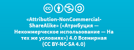

«SonarQube как платформа»
=========================

данная документация является неофициальным комплектом документов описания
платформы SonarQube, предназначенным для русскоязычной аудитории разработчиков,
релиз инженеров и менеджеров по качеству

Данная документация распространяется под открытой некоммерческой лицензией

**Attribution-NonCommercial-ShareAlike 4.0 International (CC BY-NC-SA 4.0)**

Контент доступен по следующим адресам

-   Web ссылка для чтения <https://sonar-russian.silverbulleters.org/>
    посредством платформы GitBook

-   Для скачивания в форматах PDF, ePUB, Mobi
    <https://www.gitbook.com/book/silverbulleters/sonarqube-na-russkom/details>

Авторство
---------

Авторами данной документации являются следующие участники

 

дополнительную информацию всегда можно получить в онлайн чате Giiter -
<https://gitter.im/sonarqube-ru/public>
