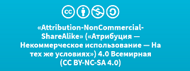

«SonarQube как платформа»
=========================

данная документация является неофициальным комплектом документов описания
платформы SonarQube, предназначенным для русскоязычной аудитории разработчиков,
релиз инженеров и менеджеров по качеству

Данная документация распространяется под открытой некоммерческой лицензией

**Attribution-NonCommercial-ShareAlike 4.0 International (CC BY-NC-SA 4.0)**

Контент доступен по следующим адресам

-   Web ссылка для чтения <https://sonar-russian.silverbulleters.org/>
    посредством платформы GitBook

-   Для скачивания в форматах PDF, ePUB, Mobi
    <https://www.gitbook.com/book/silverbulleters/sonarqube-na-russkom/details>

Авторство
---------

Авторами данной документации являются следующие участники




дополнительную информацию всегда можно получить в онлайн чате Giiter - https://gitter.im/sonarqube-ru/public

Статический анализ
------------------

Платформа ошибочно считается статическим анализатором, однако это не так.
Классическое использование статических анализаторов выглядит следующим образом

-   ответственный сотрудник запускает анализ качества кода при помощи
    статического кода

-   запуск анализа происходит время от времени

-   ответственный сотрудник видит замечания статического анализатора, если это
    делается в первый раз - то на проекте таких замечаний может быть огромное
    количество

-   ответственный сотрудник закрывает результаты проверки исправив 2-3 критичных
    замечания

Налицо проблема - **процесс статического анализа НЕ находится под управлением**

Чтобы исправить указанную проблему успешные и эффективные менеджеры запускают в
команде процесс Code Review (контроля изменений кода) - такой процесс когда
ведущий разработчик контролирует качество кодирования, указывая замечания по
коду с помощью специализированных средств менее профессиональному участнику
команды.

В этом случае возникают 3 дополнительных проблемы

-   нельзя четко быть уверенным что ведущий разработчик помнит все стандарты
    кодирования и обладает максимальным уровнем перфекционизма

-   время ведущего разработчика достаточно дорого, поэтому увеличивается
    себестоимость проекта, что чаще всего приводит к отказу от Code Review в
    силу ограниченности сроков проекта и его бюджета

Формально - наличие замечаний по коду увеличивает технический долг на проекте.
